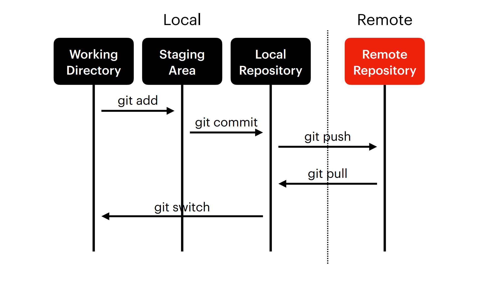

# 학습내용정리


# 1. 쉘(shell)

### 1.1 개요
-----------------------------------------------------

> 운영체제의 커널과 사용자를 이어주는 소프트웨어

#### 1.1.1 종류
-----------------------------------------------------
* 01 sh(Bourne Shell)
* 02 csh
* 03 bash
* 04 zsh

### 1.2 커맨드
-----------------------------------------------------
#### 1.2.1 폴더내 파일확인
-----------------------------------------------------
```shell
$ ls
```
예시 :
`$ ls`

#### 1.2.2 디렉토리 이동
-----------------------------------------------------
```shell
$ cd 폴더주소
```
예시 :
`$ cd Document`


#### 1.2.3 폴더생성
-----------------------------------------------------
```shell
$ mkdir 폴더명
```
예시 :
`$ mkdir dev`

#### 1.2.4 파일생성(linux환경 : ubuntu, git bash)
-----------------------------------------------------
```shell
$ touch 파일명
```
예시 :
`$ touch sample.py`

#### 1.2.5 파일생성(window환경 : powershell)
-----------------------------------------------------
```powershell
> New-Item ./파일명
```
예시 :
`New-Item ./sample.py`

#### 1.2.6 파일이동(특정폴더로)
-----------------------------------------------------
```shell
$ mv 파일명 폴더명/
```
예시 :
`$ mv sample.py dev/`

#### 1.2.7 파일이동(특정폴더로)
-----------------------------------------------------
```shell
$ cp 기존파일명 / 복사할파일명
```
예시 :
`$ cp sample.py / sample_copy.py`

#### 1.2.8 파일삭제
-----------------------------------------------------
```shell
$ rm 파일명
```
예시 :
`$ rm newfile.md`

#### 1.2.9 폴더삭제
-----------------------------------------------------
```shell
$ rm -rf 폴더명
```
예시 :
`$ rm -rf temp`

#### 1.2.10 폴더삭제
-----------------------------------------------------
```shell
$ rm 파일명
```
예시 :
`$ rm newfile.md`


#### 1.2.11 파일내용확인
-----------------------------------------------------
```shell
$ cat 파일명
```
예시 :
`$ cat README.md`


# 2. 빔(vim)

### 2.1 개요
-----------------------------------------------------

> Bill Joy의 vi 확장판으로, CLI 기반의 텍스트 편집기이다.

#### 2.1.1 모드종류
-----------------------------------------------------
01 일반모드(normal mode)
<br>&ensp;&emsp;
단축키 : (ESC)

02 편집모드(insert mode)
<br>&ensp;&emsp;
단축키 : (i)

03 블록설정(visual mode)
<br>&ensp;&emsp;
단축키 : (v)

04 액션모드(command-line mode)
<br>&ensp;&emsp;
단축키 : (:)


### 2.2 커맨드
-----------------------------------------------------


#### 2.2.1 일반모드(normal mode)
-----------------------------------------------------
```zsh
h j k l - left, down, up, right
i - insert mode
v - visual mode
ESC - back to normal mode
d - delete
dd - delete a line
y - yank
yy - yank a line
p - paste
u - undo
a - append
A - append from end of line
o - open line(under)
O - open line(upper)
H - move to the top of the screen
L - move to the bottom of the screen
```

#### 2.2.2 액션모드(command-line mode)
-----------------------------------------------------
```zsh
:q - quit
:q! - override and quit
:w - write
:wq - write and quit
:{num} - Go to {num}th line
```


# 3. 깃(git)

### 3.1 개요
-----------------------------------------------------
> 분산형 버전관리 시스템


### 3.2 업로드/다운로드 순환구조
-----------------------------------------------------

Tip! : 수정은 되도록이면 push 하기전에 할것!,
<br>
&nbsp;&ensp;&emsp;&#160;
pull 한뒤는 건드리지 않는게 좋다


### 3.3 초기설정
-----------------------------------------------------
```shell
#  개행문자 설정 (Window=true, Mac=input)
$  git config --global core.autocrlf true

#  이름 설정
$  git config --global user.name 사용자명

#  이메일 설정
$  git config --global user.email 사용자이메일주소

#  텍스트 에디터툴 설정
$  git config --global core.editor 'vim'

#  텍스트 확인용툴 설정
$  git config --global core.pager 'cat'

```

### 3.4 깃사용 순서
--------------------------------------------------------

#### 3.4.1 CLI용 (Linux기반)
-----------------------------------------------------

| 순서 |&emsp;&emsp;&emsp;내용       |콘솔 명령어                 |
|------|-----------------------------|----------------------------|
|  1   |깃 레포지토리 `[생성]`       |None                        |
|  2   |깃 레포지토리 `[클론]`       |`$ git clone 주소`          |
|  3   | .gitignore 생성및설정       |https://www.toptal.com/developers/gitignore/                |                            |
|  4   |pre-commit 설정              |(https://pre-commit.com/)                                |                            |
|<span style='background-color:gray; color:black'> 5              |<span style='background-color:gray; color:black'>파일생성`[blob]` |<span style='background-color:gray; color:black'>`$ touch 파일명` |
|  6   |파일 로컬등록`[tree]`        |`$ git add 파일명`          |
|  7   |파일커밋창 열기(vim)         |`$ git commit`              |
|<span style='background-color:gray; color:black'> 8              |<span style='background-color:gray; color:black'>vim에서 커밋내역작성                                                      |<span style='background-color:gray; color:black'>`i편집-> ESC-> : wq로 저장`                                                        |
|  9   |원격 레포지토리에 `[업로드]` |`$ git push origin 브랜치명`|

<p>
    각 단위 작업마다 4~6번 반복
    <br>
    원격 업로드시 7번수행
</p>

`🚥차이점은 형광펜 표시함`

#### 3.4.2 vsCode용 (Window기반 : powershell)
-----------------------------------------------------

| 순서 |&emsp;&emsp;&emsp;내용       |콘솔 명령어                 |
|------|-----------------------------|----------------------------|
|  1   |깃 레포지토리 `[생성]`       |None                        |
|  2   |깃 레포지토리 `[클론]`       |`$ git clone 주소`          |
|  3   | .gitignore 생성및설정       |https://www.toptal.com/developers/gitignore/                |                            |
|  4   |pre-commit 설정              |(https://pre-commit.com/)                                |                            |
|<span style='background-color:lime; color:black'> 5              |<span style='background-color:lime; color:black'>파일생성         |<span style='background-color:lime; color:black'>New-Item ./파일명|
|  6   |파일 로컬등록`[tree]`        |`$ git add 파일명`          |
|  7   |파일커밋창 열기(vim)         |`$ git commit`              |
|<span style='background-color:lime; color:black'> 8              |<span style='background-color:lime; color:black'>vsCode에서 커밋내역작성                                                      |<span style='background-color:lime; color:black'>None             |
|  9   |원격 레포지토리에 `[업로드]` |`$ git push origin 브랜치명`|

<p>
    각 단위 작업마다 4~6번 반복
    <br>
    원격 업로드시 7번수행
</p>

`🚥차이점은 형광펜 표시함`


### 3.5 커밋 컨벤션 규칙
--------------------------------------------------------

#### 3.5.1 양식
-----------------------------------------------------
```
{type} : 설명 작업단위 축약
fix!: resolve issue with login page

{body} : 작업 상세 기술
This commit fixes an issue with the login page that prevented users from logging in.

{footer} 부가정보
BREAKING CHANGE: since current version, drop social login support
```

#### 3.5.2 분류
-----------------------------------------------------

🟥 feat: 기능 개발 관련

🟧 fix: 오류 개선 혹은 버그 패치

🟨 docs: 문서화 작업

🟩 test: test 관련

🟦 conf: 환경설정 관련

🟪 build: 빌드 작업 관련

⬜ style: 코드 포매팅 관련

### 3.6 프리커밋(Pre-commit)
--------------------------------------------------------
#### 3.6.1 개요
-----------------------------------------------------
> commit 수행 전 체크해야 할 것들을 자동 수행하도록 도와주는 도구
<br>
> URL : https://pre-commit.com/


#### 3.6.2 순서
-----------------------------------------------------

1 pip pre-commit설치(전체 라이브러리에)
<br>
2 버전확인
<br>
3 .pre-commit-config.yaml 생성 및 내용작성
<br>
4 pre-commit install 설치(현재프로젝트에)
<br>
5 pre-commit 실행


```shell
# 코드

$ pip install pre-commit (or $ pip3 install pre-commit)
$ pre-commit --version
$ touch .pre-commit-config.yaml
$ vi ~/.pre-commit-config.yaml

# after setting configuration
$ pre-commit install
$ pre-commit run --all-files
```

#### 3.6.3 .pre-commit-config.yaml내용
-----------------------------------------------------
```shell
# See https://pre-commit.com for more information
# See https://pre-commit.com/hooks.html for more hooks
# See https://github.com/asottile/add-trailing-comma

repos:
-   repo: https://github.com/pre-commit/pre-commit-hooks
    rev: v3.2.0
    hooks:
    -   id: trailing-whitespace
    -   id: end-of-file-fixer
    -   id: check-yaml
    -   id: check-added-large-files
    -   id: check-ast
    -   id: double-quote-string-fixer
    -   id: check-merge-conflict
-   repo: https://github.com/asottile/add-trailing-comma
    rev: v3.1.0
    hooks:
    -   id: add-trailing-comma
```


### 3.7 브랜치
--------------------------------------------------------

#### 3.7.1 개요
--------------------------------------------------------
>분기점을 생성하여 독립적으로 코드를 변경할 수 있도록
도와주는 모델


